# COFFEE SHOP ANALYSIS #


```python
!jt -t 
```


```python
import pandas as pd
import seaborn as sns
import matplotlib.pyplot as plt
import numpy as mp
```


```python
df= pd.read_excel('/Users/DELL/Documents/Coffee Shop Sales.xlsx')

df.head()
```


<div>
<style scoped>
    .dataframe tbody tr th:only-of-type {
        vertical-align: middle;
    }

    .dataframe tbody tr th {
        vertical-align: top;
    }

    .dataframe thead th {
        text-align: right;
    }
</style>
<table border="1" class="dataframe">
  <thead>
    <tr style="text-align: right;">
      <th></th>
      <th>transaction_id</th>
      <th>transaction_date</th>
      <th>transaction_time</th>
      <th>transaction_qty</th>
      <th>store_id</th>
      <th>store_location</th>
      <th>product_id</th>
      <th>unit_price</th>
      <th>product_category</th>
      <th>product_type</th>
      <th>product_detail</th>
    </tr>
  </thead>
  <tbody>
    <tr>
      <th>0</th>
      <td>1</td>
      <td>2023-01-01</td>
      <td>07:06:11</td>
      <td>2</td>
      <td>5</td>
      <td>Lower Manhattan</td>
      <td>32</td>
      <td>3.0</td>
      <td>Coffee</td>
      <td>Gourmet brewed coffee</td>
      <td>Ethiopia Rg</td>
    </tr>
    <tr>
      <th>1</th>
      <td>2</td>
      <td>2023-01-01</td>
      <td>07:08:56</td>
      <td>2</td>
      <td>5</td>
      <td>Lower Manhattan</td>
      <td>57</td>
      <td>3.1</td>
      <td>Tea</td>
      <td>Brewed Chai tea</td>
      <td>Spicy Eye Opener Chai Lg</td>
    </tr>
    <tr>
      <th>2</th>
      <td>3</td>
      <td>2023-01-01</td>
      <td>07:14:04</td>
      <td>2</td>
      <td>5</td>
      <td>Lower Manhattan</td>
      <td>59</td>
      <td>4.5</td>
      <td>Drinking Chocolate</td>
      <td>Hot chocolate</td>
      <td>Dark chocolate Lg</td>
    </tr>
    <tr>
      <th>3</th>
      <td>4</td>
      <td>2023-01-01</td>
      <td>07:20:24</td>
      <td>1</td>
      <td>5</td>
      <td>Lower Manhattan</td>
      <td>22</td>
      <td>2.0</td>
      <td>Coffee</td>
      <td>Drip coffee</td>
      <td>Our Old Time Diner Blend Sm</td>
    </tr>
    <tr>
      <th>4</th>
      <td>5</td>
      <td>2023-01-01</td>
      <td>07:22:41</td>
      <td>2</td>
      <td>5</td>
      <td>Lower Manhattan</td>
      <td>57</td>
      <td>3.1</td>
      <td>Tea</td>
      <td>Brewed Chai tea</td>
      <td>Spicy Eye Opener Chai Lg</td>
    </tr>
  </tbody>
</table>
</div>


```python
missing_values= df.isnull().sum()
print(missing_values)
```

    transaction_id      0
    transaction_date    0
    transaction_time    0
    transaction_qty     0
    store_id            0
    store_location      0
    product_id          0
    unit_price          0
    product_category    0
    product_type        0
    product_detail      0
    dtype: int64
    


```python
df.info()
```

    <class 'pandas.core.frame.DataFrame'>
    RangeIndex: 149116 entries, 0 to 149115
    Data columns (total 11 columns):
     #   Column            Non-Null Count   Dtype          
    ---  ------            --------------   -----          
     0   transaction_id    149116 non-null  int64          
     1   transaction_date  149116 non-null  datetime64[ns] 
     2   transaction_time  149116 non-null  timedelta64[ns]
     3   transaction_qty   149116 non-null  int64          
     4   store_id          149116 non-null  int64          
     5   store_location    149116 non-null  object         
     6   product_id        149116 non-null  int64          
     7   unit_price        149116 non-null  float64        
     8   product_category  149116 non-null  object         
     9   product_type      149116 non-null  object         
     10  product_detail    149116 non-null  object         
    dtypes: datetime64[ns](1), float64(1), int64(4), object(4), timedelta64[ns](1)
    memory usage: 12.5+ MB
    


```python
df['transaction_time'] = df['transaction_time'].astype(str)
df['transaction_time'] = pd.to_timedelta(df['transaction_time'])
```


```python
df['sales'] = df['transaction_qty'] * df['unit_price']
```


```python
df['datetime'] = df['transaction_date'] + df['transaction_time']
df.head()
```


<div>
<style scoped>
    .dataframe tbody tr th:only-of-type {
        vertical-align: middle;
    }

    .dataframe tbody tr th {
        vertical-align: top;
    }

    .dataframe thead th {
        text-align: right;
    }
</style>
<table border="1" class="dataframe">
  <thead>
    <tr style="text-align: right;">
      <th></th>
      <th>transaction_id</th>
      <th>transaction_date</th>
      <th>transaction_time</th>
      <th>transaction_qty</th>
      <th>store_id</th>
      <th>store_location</th>
      <th>product_id</th>
      <th>unit_price</th>
      <th>product_category</th>
      <th>product_type</th>
      <th>product_detail</th>
      <th>sales</th>
      <th>datetime</th>
    </tr>
  </thead>
  <tbody>
    <tr>
      <th>0</th>
      <td>1</td>
      <td>2023-01-01</td>
      <td>0 days 07:06:11</td>
      <td>2</td>
      <td>5</td>
      <td>Lower Manhattan</td>
      <td>32</td>
      <td>3.0</td>
      <td>Coffee</td>
      <td>Gourmet brewed coffee</td>
      <td>Ethiopia Rg</td>
      <td>6.0</td>
      <td>2023-01-01 07:06:11</td>
    </tr>
    <tr>
      <th>1</th>
      <td>2</td>
      <td>2023-01-01</td>
      <td>0 days 07:08:56</td>
      <td>2</td>
      <td>5</td>
      <td>Lower Manhattan</td>
      <td>57</td>
      <td>3.1</td>
      <td>Tea</td>
      <td>Brewed Chai tea</td>
      <td>Spicy Eye Opener Chai Lg</td>
      <td>6.2</td>
      <td>2023-01-01 07:08:56</td>
    </tr>
    <tr>
      <th>2</th>
      <td>3</td>
      <td>2023-01-01</td>
      <td>0 days 07:14:04</td>
      <td>2</td>
      <td>5</td>
      <td>Lower Manhattan</td>
      <td>59</td>
      <td>4.5</td>
      <td>Drinking Chocolate</td>
      <td>Hot chocolate</td>
      <td>Dark chocolate Lg</td>
      <td>9.0</td>
      <td>2023-01-01 07:14:04</td>
    </tr>
    <tr>
      <th>3</th>
      <td>4</td>
      <td>2023-01-01</td>
      <td>0 days 07:20:24</td>
      <td>1</td>
      <td>5</td>
      <td>Lower Manhattan</td>
      <td>22</td>
      <td>2.0</td>
      <td>Coffee</td>
      <td>Drip coffee</td>
      <td>Our Old Time Diner Blend Sm</td>
      <td>2.0</td>
      <td>2023-01-01 07:20:24</td>
    </tr>
    <tr>
      <th>4</th>
      <td>5</td>
      <td>2023-01-01</td>
      <td>0 days 07:22:41</td>
      <td>2</td>
      <td>5</td>
      <td>Lower Manhattan</td>
      <td>57</td>
      <td>3.1</td>
      <td>Tea</td>
      <td>Brewed Chai tea</td>
      <td>Spicy Eye Opener Chai Lg</td>
      <td>6.2</td>
      <td>2023-01-01 07:22:41</td>
    </tr>
  </tbody>
</table>
</div>


```python
df.describe()
```


<div>
<style scoped>
    .dataframe tbody tr th:only-of-type {
        vertical-align: middle;
    }

    .dataframe tbody tr th {
        vertical-align: top;
    }

    .dataframe thead th {
        text-align: right;
    }
</style>
<table border="1" class="dataframe">
  <thead>
    <tr style="text-align: right;">
      <th></th>
      <th>transaction_id</th>
      <th>transaction_date</th>
      <th>transaction_time</th>
      <th>transaction_qty</th>
      <th>store_id</th>
      <th>product_id</th>
      <th>unit_price</th>
      <th>sales</th>
      <th>datetime</th>
    </tr>
  </thead>
  <tbody>
    <tr>
      <th>count</th>
      <td>149116.000000</td>
      <td>149116</td>
      <td>149116</td>
      <td>149116.000000</td>
      <td>149116.000000</td>
      <td>149116.000000</td>
      <td>149116.000000</td>
      <td>149116.000000</td>
      <td>149116</td>
    </tr>
    <tr>
      <th>mean</th>
      <td>74737.371872</td>
      <td>2023-04-15 11:50:32.173609984</td>
      <td>0 days 12:14:15.815794415</td>
      <td>1.438276</td>
      <td>5.342063</td>
      <td>47.918607</td>
      <td>3.382219</td>
      <td>4.686367</td>
      <td>2023-04-16 00:04:47.989404160</td>
    </tr>
    <tr>
      <th>min</th>
      <td>1.000000</td>
      <td>2023-01-01 00:00:00</td>
      <td>0 days 06:00:00</td>
      <td>1.000000</td>
      <td>3.000000</td>
      <td>1.000000</td>
      <td>0.800000</td>
      <td>0.800000</td>
      <td>2023-01-01 07:06:11</td>
    </tr>
    <tr>
      <th>25%</th>
      <td>37335.750000</td>
      <td>2023-03-06 00:00:00</td>
      <td>0 days 09:05:10.500000</td>
      <td>1.000000</td>
      <td>3.000000</td>
      <td>33.000000</td>
      <td>2.500000</td>
      <td>3.000000</td>
      <td>2023-03-06 13:37:08</td>
    </tr>
    <tr>
      <th>50%</th>
      <td>74727.500000</td>
      <td>2023-04-24 00:00:00</td>
      <td>0 days 11:15:28</td>
      <td>1.000000</td>
      <td>5.000000</td>
      <td>47.000000</td>
      <td>3.000000</td>
      <td>3.750000</td>
      <td>2023-04-24 08:24:32.500000</td>
    </tr>
    <tr>
      <th>75%</th>
      <td>112094.250000</td>
      <td>2023-05-30 00:00:00</td>
      <td>0 days 15:25:57</td>
      <td>2.000000</td>
      <td>8.000000</td>
      <td>60.000000</td>
      <td>3.750000</td>
      <td>6.000000</td>
      <td>2023-05-30 07:16:13</td>
    </tr>
    <tr>
      <th>max</th>
      <td>149456.000000</td>
      <td>2023-06-30 00:00:00</td>
      <td>0 days 20:59:32</td>
      <td>8.000000</td>
      <td>8.000000</td>
      <td>87.000000</td>
      <td>45.000000</td>
      <td>360.000000</td>
      <td>2023-06-30 20:57:19</td>
    </tr>
    <tr>
      <th>std</th>
      <td>43153.600016</td>
      <td>NaN</td>
      <td>0 days 03:45:57.901686173</td>
      <td>0.542509</td>
      <td>2.074241</td>
      <td>17.930020</td>
      <td>2.658723</td>
      <td>4.227099</td>
      <td>NaN</td>
    </tr>
  </tbody>
</table>
</div>


```python
df_location = df.groupby('store_location').agg({
    'sales': 'sum',
    'transaction_id': 'count'
})
df_location
```


<div>
<style scoped>
    .dataframe tbody tr th:only-of-type {
        vertical-align: middle;
    }

    .dataframe tbody tr th {
        vertical-align: top;
    }

    .dataframe thead th {
        text-align: right;
    }
</style>
<table border="1" class="dataframe">
  <thead>
    <tr style="text-align: right;">
      <th></th>
      <th>sales</th>
      <th>transaction_id</th>
    </tr>
    <tr>
      <th>store_location</th>
      <th></th>
      <th></th>
    </tr>
  </thead>
  <tbody>
    <tr>
      <th>Astoria</th>
      <td>232243.91</td>
      <td>50599</td>
    </tr>
    <tr>
      <th>Hell's Kitchen</th>
      <td>236511.17</td>
      <td>50735</td>
    </tr>
    <tr>
      <th>Lower Manhattan</th>
      <td>230057.25</td>
      <td>47782</td>
    </tr>
  </tbody>
</table>
</div>


```python
daily_sales_by_location = df.groupby(['transaction_date', 'store_location'])['sales'].sum().unstack()
daily_sales_by_location
```


<div>
<style scoped>
    .dataframe tbody tr th:only-of-type {
        vertical-align: middle;
    }

    .dataframe tbody tr th {
        vertical-align: top;
    }

    .dataframe thead th {
        text-align: right;
    }
</style>
<table border="1" class="dataframe">
  <thead>
    <tr style="text-align: right;">
      <th>store_location</th>
      <th>Astoria</th>
      <th>Hell's Kitchen</th>
      <th>Lower Manhattan</th>
    </tr>
    <tr>
      <th>transaction_date</th>
      <th></th>
      <th></th>
      <th></th>
    </tr>
  </thead>
  <tbody>
    <tr>
      <th>2023-01-01</th>
      <td>868.40</td>
      <td>851.45</td>
      <td>788.35</td>
    </tr>
    <tr>
      <th>2023-01-02</th>
      <td>925.50</td>
      <td>828.80</td>
      <td>649.05</td>
    </tr>
    <tr>
      <th>2023-01-03</th>
      <td>902.75</td>
      <td>906.25</td>
      <td>756.00</td>
    </tr>
    <tr>
      <th>2023-01-04</th>
      <td>808.25</td>
      <td>781.65</td>
      <td>630.20</td>
    </tr>
    <tr>
      <th>2023-01-05</th>
      <td>903.05</td>
      <td>714.90</td>
      <td>800.90</td>
    </tr>
    <tr>
      <th>...</th>
      <td>...</td>
      <td>...</td>
      <td>...</td>
    </tr>
    <tr>
      <th>2023-06-26</th>
      <td>1975.10</td>
      <td>1746.10</td>
      <td>2154.70</td>
    </tr>
    <tr>
      <th>2023-06-27</th>
      <td>1861.55</td>
      <td>1676.70</td>
      <td>2437.40</td>
    </tr>
    <tr>
      <th>2023-06-28</th>
      <td>1758.10</td>
      <td>1445.85</td>
      <td>1524.95</td>
    </tr>
    <tr>
      <th>2023-06-29</th>
      <td>1852.75</td>
      <td>1298.55</td>
      <td>1299.45</td>
    </tr>
    <tr>
      <th>2023-06-30</th>
      <td>1807.65</td>
      <td>1904.93</td>
      <td>1768.74</td>
    </tr>
  </tbody>
</table>
<p>181 rows × 3 columns</p>
</div>


```python
daily_sales_by_location.plot(figsize=(14, 8), title='Daily sales by store location')
plt.xlabel('Date')
plt.ylabel('total Sales ($)')
plt.legend(title='store location')
plt.grid(True)
plt.xticks(rotation=45)
plt.tight_layout()

#show the plot
plt.show()
```


    
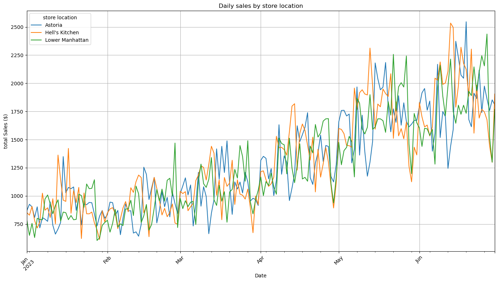
    


```python
plt.figure(figsize=(14, 8))

plt.stackplot(daily_sales_by_location.index, daily_sales_by_location.T, labels=daily_sales_by_location.columns)

plt.title('Daily Sales by Store Location (stacked Area chart)')
plt.xlabel('Date')
plt.ylabel('Total Sales ($)')
plt.legend(title='Store location', loc='upper left')
plt.grid(True)
plt.xticks(rotation=45)
plt.tight_layout()

# show the plot
plt.show()
```


    
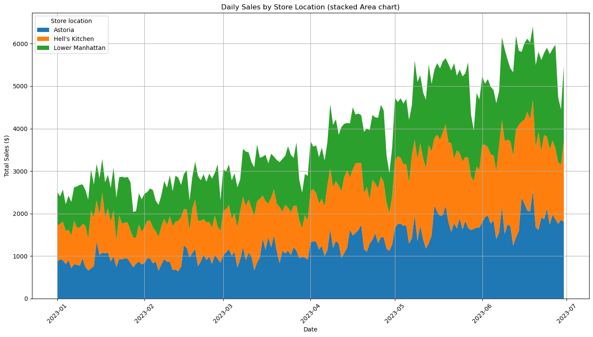
    


```python
daily_sales = df.groupby('transaction_date')['sales'].sum().reset_index()

df['day_of_week'] = df['datetime'].dt.day_name()

weekly_sales = df.groupby('day_of_week')['sales'].sum().reindex(
    ['Monday', 'Tuesday', 'Wednesday', 'Thursday', 'Friday', 'Saturday']).reset_index()

df['month'] = df['datetime'].dt.to_period('M')
monthly_sales = df.groupby('month')['sales'].sum().reset_index()

daily_sales, weekly_sales, monthly_sales

```


    (    transaction_date    sales
     0         2023-01-01  2508.20
     1         2023-01-02  2403.35
     2         2023-01-03  2565.00
     3         2023-01-04  2220.10
     4         2023-01-05  2418.85
     ..               ...      ...
     176       2023-06-26  5875.90
     177       2023-06-27  5975.65
     178       2023-06-28  4728.90
     179       2023-06-29  4450.75
     180       2023-06-30  5481.32
     
     [181 rows x 2 columns],
       day_of_week      sales
     0      Monday  101677.28
     1     Tuesday   99455.94
     2   Wednesday  100313.54
     3    Thursday  100767.78
     4      Friday  101373.00
     5    Saturday   96894.48,
          month      sales
     0  2023-01   81677.74
     1  2023-02   76145.19
     2  2023-03   98834.68
     3  2023-04  118941.08
     4  2023-05  156727.76
     5  2023-06  166485.88)


```python
monthly_sales.plot(figsize=(14, 8), title='Monthly Sales')

plt.xlabel('Date')
plt.ylabel('Total Sales ($)')
plt.grid(True)
plt.xticks(rotation=45)
plt.tight_layout()
# show the plot
plt.show()
```


    
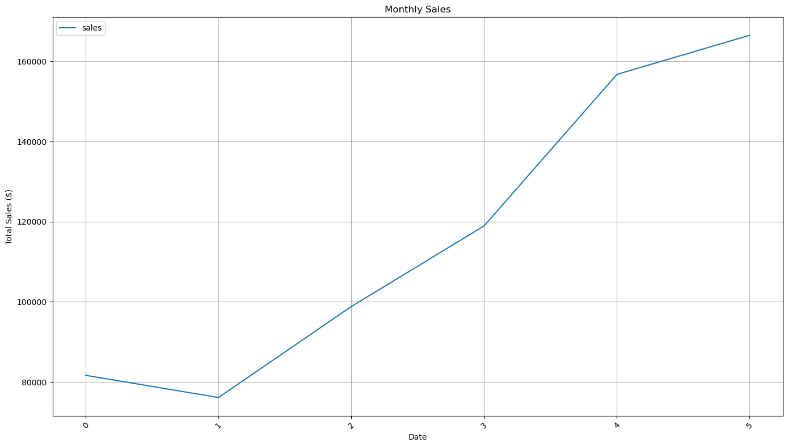
    


```python
weekly_sales = df.groupby(['day_of_week', 'store_location'])['sales'].sum().unstack()
days_order = ['Monday', 'Tuesday', 'Wednesday', 'Thursday', 'Friday', 'Saturday', 'Sunday']
weekly_sales = weekly_sales.reindex(days_order)
weekly_sales
```


<div>
<style scoped>
    .dataframe tbody tr th:only-of-type {
        vertical-align: middle;
    }

    .dataframe tbody tr th {
        vertical-align: top;
    }

    .dataframe thead th {
        text-align: right;
    }
</style>
<table border="1" class="dataframe">
  <thead>
    <tr style="text-align: right;">
      <th>store_location</th>
      <th>Astoria</th>
      <th>Hell's Kitchen</th>
      <th>Lower Manhattan</th>
    </tr>
    <tr>
      <th>day_of_week</th>
      <th></th>
      <th></th>
      <th></th>
    </tr>
  </thead>
  <tbody>
    <tr>
      <th>Monday</th>
      <td>33928.29</td>
      <td>33389.51</td>
      <td>34359.48</td>
    </tr>
    <tr>
      <th>Tuesday</th>
      <td>31816.76</td>
      <td>34846.47</td>
      <td>32792.71</td>
    </tr>
    <tr>
      <th>Wednesday</th>
      <td>34244.63</td>
      <td>33779.09</td>
      <td>32289.82</td>
    </tr>
    <tr>
      <th>Thursday</th>
      <td>34140.37</td>
      <td>33468.06</td>
      <td>33159.35</td>
    </tr>
    <tr>
      <th>Friday</th>
      <td>33472.75</td>
      <td>34743.18</td>
      <td>33157.07</td>
    </tr>
    <tr>
      <th>Saturday</th>
      <td>31845.93</td>
      <td>32599.23</td>
      <td>32449.32</td>
    </tr>
    <tr>
      <th>Sunday</th>
      <td>32795.18</td>
      <td>33685.63</td>
      <td>31849.50</td>
    </tr>
  </tbody>
</table>
</div>


```python
weekly_sales[["Astoria","Hell's Kitchen","Lower Manhattan"]].plot(kind='bar',figsize=(14, 8))

plt.xlabel('Day of the week', fontweight='bold')
plt.ylabel('Total sales ($)', fontweight='bold')
plt.title('Weekly sales by store Location')
plt.legend(title='store location', loc='upper left')

# show the plot
plt.tight_layout()
plt.show()
```


    
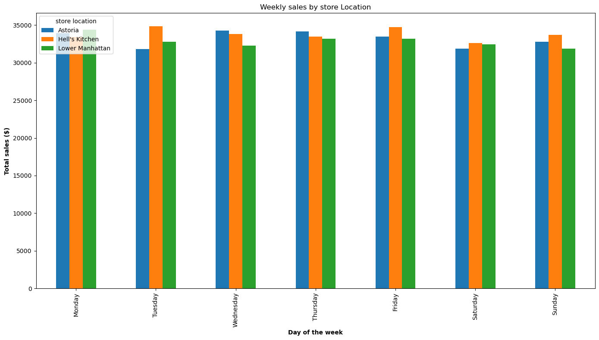
    


```python
df_category = df.groupby('product_category').agg({
    'sales': 'sum',
    'transaction_id': 'count'
}).sort_values('sales', ascending = False)

df_category
```


<div>
<style scoped>
    .dataframe tbody tr th:only-of-type {
        vertical-align: middle;
    }

    .dataframe tbody tr th {
        vertical-align: top;
    }

    .dataframe thead th {
        text-align: right;
    }
</style>
<table border="1" class="dataframe">
  <thead>
    <tr style="text-align: right;">
      <th></th>
      <th>sales</th>
      <th>transaction_id</th>
    </tr>
    <tr>
      <th>product_category</th>
      <th></th>
      <th></th>
    </tr>
  </thead>
  <tbody>
    <tr>
      <th>Coffee</th>
      <td>269952.45</td>
      <td>58416</td>
    </tr>
    <tr>
      <th>Tea</th>
      <td>196405.95</td>
      <td>45449</td>
    </tr>
    <tr>
      <th>Bakery</th>
      <td>82315.64</td>
      <td>22796</td>
    </tr>
    <tr>
      <th>Drinking Chocolate</th>
      <td>72416.00</td>
      <td>11468</td>
    </tr>
    <tr>
      <th>Coffee beans</th>
      <td>40085.25</td>
      <td>1753</td>
    </tr>
    <tr>
      <th>Branded</th>
      <td>13607.00</td>
      <td>747</td>
    </tr>
    <tr>
      <th>Loose Tea</th>
      <td>11213.60</td>
      <td>1210</td>
    </tr>
    <tr>
      <th>Flavours</th>
      <td>8408.80</td>
      <td>6790</td>
    </tr>
    <tr>
      <th>Packaged Chocolate</th>
      <td>4407.64</td>
      <td>487</td>
    </tr>
  </tbody>
</table>
</div>


```python
df['hour'] = df['datetime'].dt.hour

hourly_sales_by_product = df.groupby(['hour', 'product_category'])['sales'].sum().unstack()

hourly_sales_by_product.plot(kind='bar', stacked=True, figsize=(14, 8), colormap='viridis')

plt.xlabel('Hourly Sales by Product Category')
plt.ylabel('Hour of the Day')
plt.title('Total Sales ($)')
plt.legend(title='product Category', loc='upper right')
plt.grid(True)

# show the plot
plt.tight_layout()
plt.show()

```


    
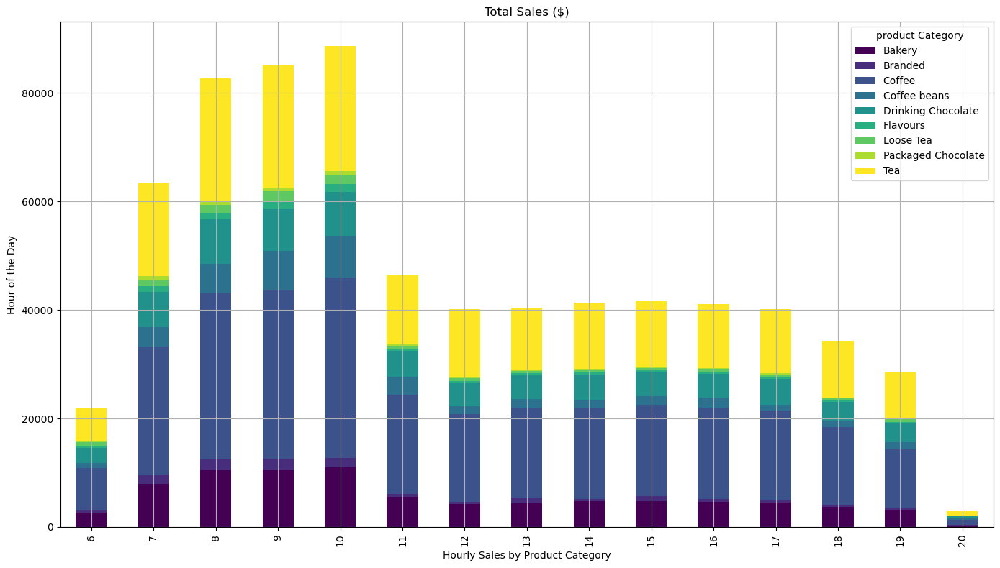
    


```python
df_category['avg_sales'] = df_category['sales']/df_category['transaction_id']
df_category
```


<div>
<style scoped>
    .dataframe tbody tr th:only-of-type {
        vertical-align: middle;
    }

    .dataframe tbody tr th {
        vertical-align: top;
    }

    .dataframe thead th {
        text-align: right;
    }
</style>
<table border="1" class="dataframe">
  <thead>
    <tr style="text-align: right;">
      <th></th>
      <th>sales</th>
      <th>transaction_id</th>
      <th>avg_sales</th>
    </tr>
    <tr>
      <th>product_category</th>
      <th></th>
      <th></th>
      <th></th>
    </tr>
  </thead>
  <tbody>
    <tr>
      <th>Coffee</th>
      <td>269952.45</td>
      <td>58416</td>
      <td>4.621207</td>
    </tr>
    <tr>
      <th>Tea</th>
      <td>196405.95</td>
      <td>45449</td>
      <td>4.321458</td>
    </tr>
    <tr>
      <th>Bakery</th>
      <td>82315.64</td>
      <td>22796</td>
      <td>3.610969</td>
    </tr>
    <tr>
      <th>Drinking Chocolate</th>
      <td>72416.00</td>
      <td>11468</td>
      <td>6.314615</td>
    </tr>
    <tr>
      <th>Coffee beans</th>
      <td>40085.25</td>
      <td>1753</td>
      <td>22.866657</td>
    </tr>
    <tr>
      <th>Branded</th>
      <td>13607.00</td>
      <td>747</td>
      <td>18.215529</td>
    </tr>
    <tr>
      <th>Loose Tea</th>
      <td>11213.60</td>
      <td>1210</td>
      <td>9.267438</td>
    </tr>
    <tr>
      <th>Flavours</th>
      <td>8408.80</td>
      <td>6790</td>
      <td>1.238409</td>
    </tr>
    <tr>
      <th>Packaged Chocolate</th>
      <td>4407.64</td>
      <td>487</td>
      <td>9.050595</td>
    </tr>
  </tbody>
</table>
</div>


```python
sales_by_product = df.groupby('product_type').agg({
    'sales': 'sum',
    'unit_price': 'mean'
}).sort_values('sales', ascending = False)

sales_by_product
```


<div>
<style scoped>
    .dataframe tbody tr th:only-of-type {
        vertical-align: middle;
    }

    .dataframe tbody tr th {
        vertical-align: top;
    }

    .dataframe thead th {
        text-align: right;
    }
</style>
<table border="1" class="dataframe">
  <thead>
    <tr style="text-align: right;">
      <th></th>
      <th>sales</th>
      <th>unit_price</th>
    </tr>
    <tr>
      <th>product_type</th>
      <th></th>
      <th></th>
    </tr>
  </thead>
  <tbody>
    <tr>
      <th>Barista Espresso</th>
      <td>91406.20</td>
      <td>3.655200</td>
    </tr>
    <tr>
      <th>Brewed Chai tea</th>
      <td>77081.95</td>
      <td>2.936993</td>
    </tr>
    <tr>
      <th>Hot chocolate</th>
      <td>72416.00</td>
      <td>4.148827</td>
    </tr>
    <tr>
      <th>Gourmet brewed coffee</th>
      <td>70034.60</td>
      <td>2.696641</td>
    </tr>
    <tr>
      <th>Brewed Black tea</th>
      <td>47932.00</td>
      <td>2.744670</td>
    </tr>
    <tr>
      <th>Brewed herbal tea</th>
      <td>47539.50</td>
      <td>2.744731</td>
    </tr>
    <tr>
      <th>Premium brewed coffee</th>
      <td>38781.15</td>
      <td>3.122452</td>
    </tr>
    <tr>
      <th>Organic brewed coffee</th>
      <td>37746.50</td>
      <td>2.898021</td>
    </tr>
    <tr>
      <th>Scone</th>
      <td>36866.12</td>
      <td>3.534638</td>
    </tr>
    <tr>
      <th>Drip coffee</th>
      <td>31984.00</td>
      <td>2.484959</td>
    </tr>
    <tr>
      <th>Pastry</th>
      <td>25655.99</td>
      <td>3.685979</td>
    </tr>
    <tr>
      <th>Brewed Green tea</th>
      <td>23852.50</td>
      <td>2.742462</td>
    </tr>
    <tr>
      <th>Biscotti</th>
      <td>19793.53</td>
      <td>3.419503</td>
    </tr>
    <tr>
      <th>Premium Beans</th>
      <td>14583.50</td>
      <td>34.028274</td>
    </tr>
    <tr>
      <th>Organic Beans</th>
      <td>8509.50</td>
      <td>20.287952</td>
    </tr>
    <tr>
      <th>Housewares</th>
      <td>7444.00</td>
      <td>13.448669</td>
    </tr>
    <tr>
      <th>Gourmet Beans</th>
      <td>6798.00</td>
      <td>18.573770</td>
    </tr>
    <tr>
      <th>Clothing</th>
      <td>6163.00</td>
      <td>27.886878</td>
    </tr>
    <tr>
      <th>Regular syrup</th>
      <td>6084.80</td>
      <td>0.800000</td>
    </tr>
    <tr>
      <th>Espresso Beans</th>
      <td>5560.25</td>
      <td>17.430251</td>
    </tr>
    <tr>
      <th>Chai tea</th>
      <td>4301.25</td>
      <td>9.709368</td>
    </tr>
    <tr>
      <th>House blend Beans</th>
      <td>3294.00</td>
      <td>18.000000</td>
    </tr>
    <tr>
      <th>Herbal tea</th>
      <td>2729.75</td>
      <td>8.950000</td>
    </tr>
    <tr>
      <th>Drinking Chocolate</th>
      <td>2728.04</td>
      <td>10.255789</td>
    </tr>
    <tr>
      <th>Black tea</th>
      <td>2711.85</td>
      <td>8.950000</td>
    </tr>
    <tr>
      <th>Sugar free syrup</th>
      <td>2324.00</td>
      <td>0.800000</td>
    </tr>
    <tr>
      <th>Organic Chocolate</th>
      <td>1679.60</td>
      <td>7.600000</td>
    </tr>
    <tr>
      <th>Green tea</th>
      <td>1470.75</td>
      <td>9.250000</td>
    </tr>
    <tr>
      <th>Green beans</th>
      <td>1340.00</td>
      <td>10.000000</td>
    </tr>
  </tbody>
</table>
</div>


```python
product_sales_df = df.groupby(['product_category', 'product_type'])['sales'].sum().reset_index()
product_sales_df
```


<div>
<style scoped>
    .dataframe tbody tr th:only-of-type {
        vertical-align: middle;
    }

    .dataframe tbody tr th {
        vertical-align: top;
    }

    .dataframe thead th {
        text-align: right;
    }
</style>
<table border="1" class="dataframe">
  <thead>
    <tr style="text-align: right;">
      <th></th>
      <th>product_category</th>
      <th>product_type</th>
      <th>sales</th>
    </tr>
  </thead>
  <tbody>
    <tr>
      <th>0</th>
      <td>Bakery</td>
      <td>Biscotti</td>
      <td>19793.53</td>
    </tr>
    <tr>
      <th>1</th>
      <td>Bakery</td>
      <td>Pastry</td>
      <td>25655.99</td>
    </tr>
    <tr>
      <th>2</th>
      <td>Bakery</td>
      <td>Scone</td>
      <td>36866.12</td>
    </tr>
    <tr>
      <th>3</th>
      <td>Branded</td>
      <td>Clothing</td>
      <td>6163.00</td>
    </tr>
    <tr>
      <th>4</th>
      <td>Branded</td>
      <td>Housewares</td>
      <td>7444.00</td>
    </tr>
    <tr>
      <th>5</th>
      <td>Coffee</td>
      <td>Barista Espresso</td>
      <td>91406.20</td>
    </tr>
    <tr>
      <th>6</th>
      <td>Coffee</td>
      <td>Drip coffee</td>
      <td>31984.00</td>
    </tr>
    <tr>
      <th>7</th>
      <td>Coffee</td>
      <td>Gourmet brewed coffee</td>
      <td>70034.60</td>
    </tr>
    <tr>
      <th>8</th>
      <td>Coffee</td>
      <td>Organic brewed coffee</td>
      <td>37746.50</td>
    </tr>
    <tr>
      <th>9</th>
      <td>Coffee</td>
      <td>Premium brewed coffee</td>
      <td>38781.15</td>
    </tr>
    <tr>
      <th>10</th>
      <td>Coffee beans</td>
      <td>Espresso Beans</td>
      <td>5560.25</td>
    </tr>
    <tr>
      <th>11</th>
      <td>Coffee beans</td>
      <td>Gourmet Beans</td>
      <td>6798.00</td>
    </tr>
    <tr>
      <th>12</th>
      <td>Coffee beans</td>
      <td>Green beans</td>
      <td>1340.00</td>
    </tr>
    <tr>
      <th>13</th>
      <td>Coffee beans</td>
      <td>House blend Beans</td>
      <td>3294.00</td>
    </tr>
    <tr>
      <th>14</th>
      <td>Coffee beans</td>
      <td>Organic Beans</td>
      <td>8509.50</td>
    </tr>
    <tr>
      <th>15</th>
      <td>Coffee beans</td>
      <td>Premium Beans</td>
      <td>14583.50</td>
    </tr>
    <tr>
      <th>16</th>
      <td>Drinking Chocolate</td>
      <td>Hot chocolate</td>
      <td>72416.00</td>
    </tr>
    <tr>
      <th>17</th>
      <td>Flavours</td>
      <td>Regular syrup</td>
      <td>6084.80</td>
    </tr>
    <tr>
      <th>18</th>
      <td>Flavours</td>
      <td>Sugar free syrup</td>
      <td>2324.00</td>
    </tr>
    <tr>
      <th>19</th>
      <td>Loose Tea</td>
      <td>Black tea</td>
      <td>2711.85</td>
    </tr>
    <tr>
      <th>20</th>
      <td>Loose Tea</td>
      <td>Chai tea</td>
      <td>4301.25</td>
    </tr>
    <tr>
      <th>21</th>
      <td>Loose Tea</td>
      <td>Green tea</td>
      <td>1470.75</td>
    </tr>
    <tr>
      <th>22</th>
      <td>Loose Tea</td>
      <td>Herbal tea</td>
      <td>2729.75</td>
    </tr>
    <tr>
      <th>23</th>
      <td>Packaged Chocolate</td>
      <td>Drinking Chocolate</td>
      <td>2728.04</td>
    </tr>
    <tr>
      <th>24</th>
      <td>Packaged Chocolate</td>
      <td>Organic Chocolate</td>
      <td>1679.60</td>
    </tr>
    <tr>
      <th>25</th>
      <td>Tea</td>
      <td>Brewed Black tea</td>
      <td>47932.00</td>
    </tr>
    <tr>
      <th>26</th>
      <td>Tea</td>
      <td>Brewed Chai tea</td>
      <td>77081.95</td>
    </tr>
    <tr>
      <th>27</th>
      <td>Tea</td>
      <td>Brewed Green tea</td>
      <td>23852.50</td>
    </tr>
    <tr>
      <th>28</th>
      <td>Tea</td>
      <td>Brewed herbal tea</td>
      <td>47539.50</td>
    </tr>
  </tbody>
</table>
</div>


```python
plt.figure(figsize=(14, 8))
sns.barplot(data=product_sales_df, x='product_category', y='sales', hue='product_type')

# Add labels and title
plt.xlabel('product category')
plt.ylabel('Total sales ($)')
plt.title('product sales by category and type')
plt.legend(title='Product type', loc='upper right')

# show the plot
plt.tight_layout()
plt.show()
```


    
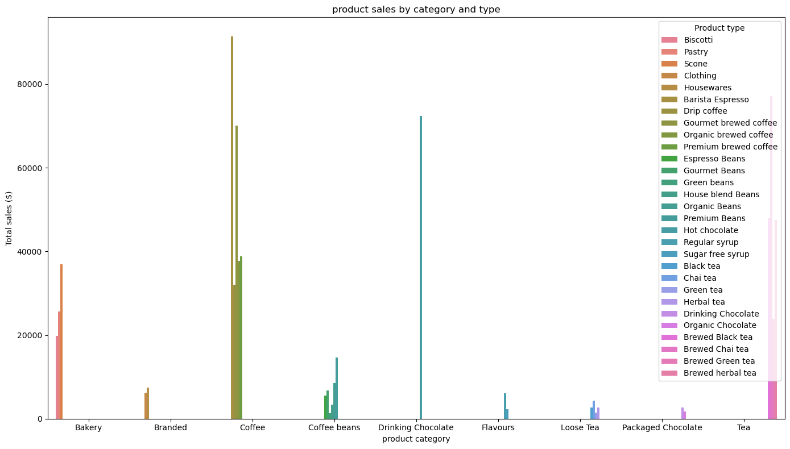
    


```python
categories = product_sales_df['product_category'].unique()

for category in categories:
    plt.figure(figsize=(5, 5))
    category_data = product_sales_df[product_sales_df['product_category'] == category]
    sns.barplot(data=category_data, x='product_type', y='sales')

    # Add labels and title
    plt.title(f'Sales by Product Type in (category)')
    plt.xlabel('Product Type')
    plt.ylabel('Total Sales ($)')
    plt.xticks(rotation=45)

    # Show the plot
    plt.tight_layout()
    plt.show()
```


    
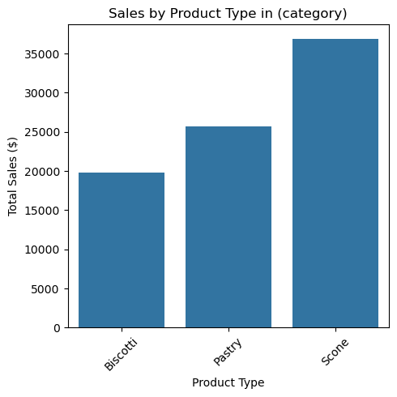
    


    
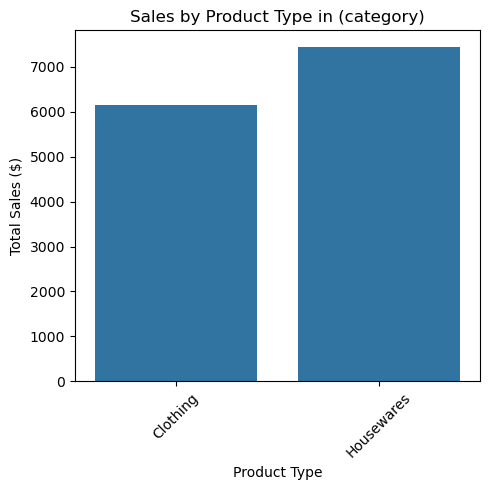
    


    
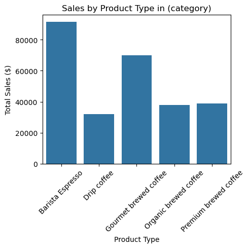
    


    
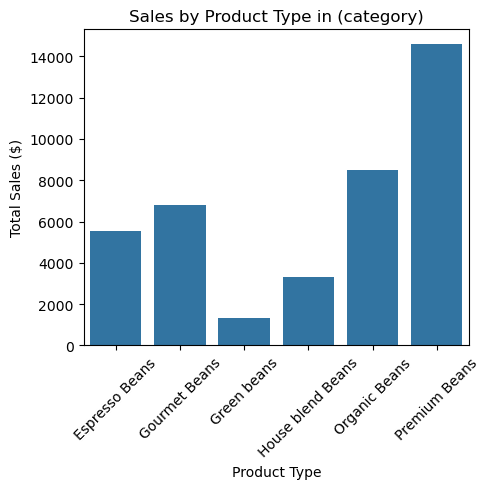
    


    
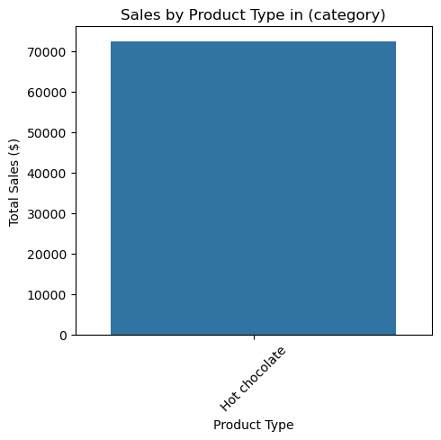
    


    
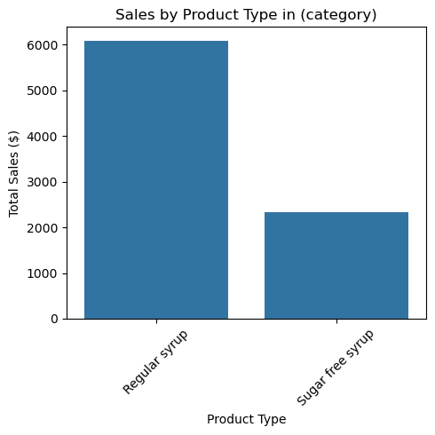
    


    
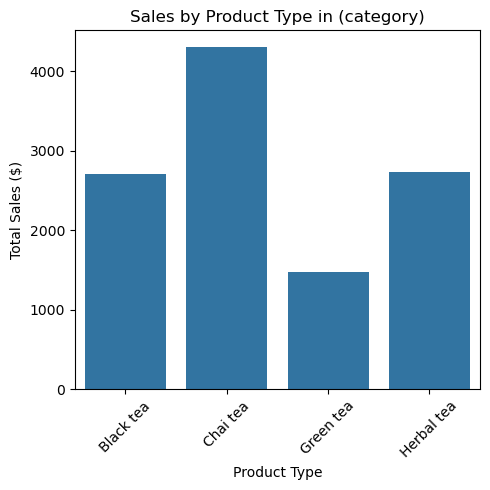
    


    
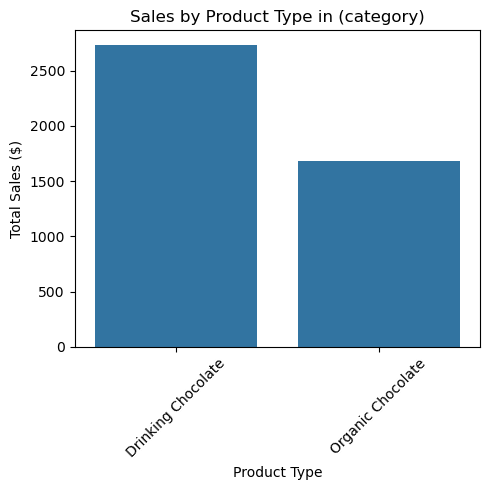
    


    
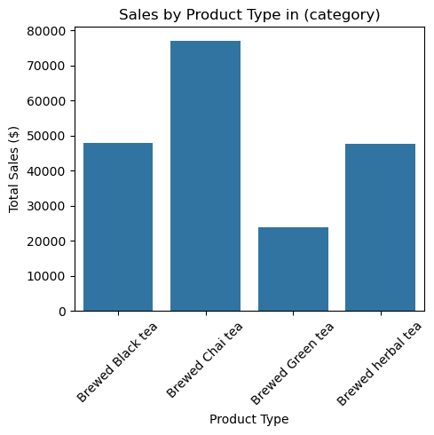
    


```python
hourly_sales_by_location = df.groupby(['store_location', 'hour'])['sales'].sum().reset_index()
hourly_sales_by_location
```


<div>
<style scoped>
    .dataframe tbody tr th:only-of-type {
        vertical-align: middle;
    }

    .dataframe tbody tr th {
        vertical-align: top;
    }

    .dataframe thead th {
        text-align: right;
    }
</style>
<table border="1" class="dataframe">
  <thead>
    <tr style="text-align: right;">
      <th></th>
      <th>store_location</th>
      <th>hour</th>
      <th>sales</th>
    </tr>
  </thead>
  <tbody>
    <tr>
      <th>0</th>
      <td>Astoria</td>
      <td>7</td>
      <td>19028.80</td>
    </tr>
    <tr>
      <th>1</th>
      <td>Astoria</td>
      <td>8</td>
      <td>22805.90</td>
    </tr>
    <tr>
      <th>2</th>
      <td>Astoria</td>
      <td>9</td>
      <td>23183.57</td>
    </tr>
    <tr>
      <th>3</th>
      <td>Astoria</td>
      <td>10</td>
      <td>24426.12</td>
    </tr>
    <tr>
      <th>4</th>
      <td>Astoria</td>
      <td>11</td>
      <td>15498.13</td>
    </tr>
    <tr>
      <th>5</th>
      <td>Astoria</td>
      <td>12</td>
      <td>15681.20</td>
    </tr>
    <tr>
      <th>6</th>
      <td>Astoria</td>
      <td>13</td>
      <td>15947.87</td>
    </tr>
    <tr>
      <th>7</th>
      <td>Astoria</td>
      <td>14</td>
      <td>15175.27</td>
    </tr>
    <tr>
      <th>8</th>
      <td>Astoria</td>
      <td>15</td>
      <td>15651.95</td>
    </tr>
    <tr>
      <th>9</th>
      <td>Astoria</td>
      <td>16</td>
      <td>16110.85</td>
    </tr>
    <tr>
      <th>10</th>
      <td>Astoria</td>
      <td>17</td>
      <td>15839.30</td>
    </tr>
    <tr>
      <th>11</th>
      <td>Astoria</td>
      <td>18</td>
      <td>15951.30</td>
    </tr>
    <tr>
      <th>12</th>
      <td>Astoria</td>
      <td>19</td>
      <td>16943.65</td>
    </tr>
    <tr>
      <th>13</th>
      <td>Hell's Kitchen</td>
      <td>6</td>
      <td>7531.17</td>
    </tr>
    <tr>
      <th>14</th>
      <td>Hell's Kitchen</td>
      <td>7</td>
      <td>15961.05</td>
    </tr>
    <tr>
      <th>15</th>
      <td>Hell's Kitchen</td>
      <td>8</td>
      <td>31544.44</td>
    </tr>
    <tr>
      <th>16</th>
      <td>Hell's Kitchen</td>
      <td>9</td>
      <td>32874.29</td>
    </tr>
    <tr>
      <th>17</th>
      <td>Hell's Kitchen</td>
      <td>10</td>
      <td>33605.81</td>
    </tr>
    <tr>
      <th>18</th>
      <td>Hell's Kitchen</td>
      <td>11</td>
      <td>17926.54</td>
    </tr>
    <tr>
      <th>19</th>
      <td>Hell's Kitchen</td>
      <td>12</td>
      <td>11343.10</td>
    </tr>
    <tr>
      <th>20</th>
      <td>Hell's Kitchen</td>
      <td>13</td>
      <td>12070.10</td>
    </tr>
    <tr>
      <th>21</th>
      <td>Hell's Kitchen</td>
      <td>14</td>
      <td>12297.50</td>
    </tr>
    <tr>
      <th>22</th>
      <td>Hell's Kitchen</td>
      <td>15</td>
      <td>11311.25</td>
    </tr>
    <tr>
      <th>23</th>
      <td>Hell's Kitchen</td>
      <td>16</td>
      <td>11990.48</td>
    </tr>
    <tr>
      <th>24</th>
      <td>Hell's Kitchen</td>
      <td>17</td>
      <td>12789.50</td>
    </tr>
    <tr>
      <th>25</th>
      <td>Hell's Kitchen</td>
      <td>18</td>
      <td>11863.21</td>
    </tr>
    <tr>
      <th>26</th>
      <td>Hell's Kitchen</td>
      <td>19</td>
      <td>10766.36</td>
    </tr>
    <tr>
      <th>27</th>
      <td>Hell's Kitchen</td>
      <td>20</td>
      <td>2636.37</td>
    </tr>
    <tr>
      <th>28</th>
      <td>Lower Manhattan</td>
      <td>6</td>
      <td>14369.10</td>
    </tr>
    <tr>
      <th>29</th>
      <td>Lower Manhattan</td>
      <td>7</td>
      <td>28536.62</td>
    </tr>
    <tr>
      <th>30</th>
      <td>Lower Manhattan</td>
      <td>8</td>
      <td>28349.53</td>
    </tr>
    <tr>
      <th>31</th>
      <td>Lower Manhattan</td>
      <td>9</td>
      <td>29111.67</td>
    </tr>
    <tr>
      <th>32</th>
      <td>Lower Manhattan</td>
      <td>10</td>
      <td>30641.46</td>
    </tr>
    <tr>
      <th>33</th>
      <td>Lower Manhattan</td>
      <td>11</td>
      <td>12894.47</td>
    </tr>
    <tr>
      <th>34</th>
      <td>Lower Manhattan</td>
      <td>12</td>
      <td>13168.49</td>
    </tr>
    <tr>
      <th>35</th>
      <td>Lower Manhattan</td>
      <td>13</td>
      <td>12349.48</td>
    </tr>
    <tr>
      <th>36</th>
      <td>Lower Manhattan</td>
      <td>14</td>
      <td>13831.97</td>
    </tr>
    <tr>
      <th>37</th>
      <td>Lower Manhattan</td>
      <td>15</td>
      <td>14769.90</td>
    </tr>
    <tr>
      <th>38</th>
      <td>Lower Manhattan</td>
      <td>16</td>
      <td>13021.42</td>
    </tr>
    <tr>
      <th>39</th>
      <td>Lower Manhattan</td>
      <td>17</td>
      <td>11505.51</td>
    </tr>
    <tr>
      <th>40</th>
      <td>Lower Manhattan</td>
      <td>18</td>
      <td>6471.69</td>
    </tr>
    <tr>
      <th>41</th>
      <td>Lower Manhattan</td>
      <td>19</td>
      <td>736.67</td>
    </tr>
    <tr>
      <th>42</th>
      <td>Lower Manhattan</td>
      <td>20</td>
      <td>299.27</td>
    </tr>
  </tbody>
</table>
</div>


```python
plt.figure(figsize=(14, 8))
sns.barplot(data=hourly_sales_by_location, x='hour', y='sales', hue='store_location')

plt.title('Hourly Sales by Store location')
plt.xlabel('Hour of the Day')
plt.ylabel('Total sales')
plt.legend(title='Store location', loc='upper right')
plt.grid(True)
plt.tight_layout()
```


    
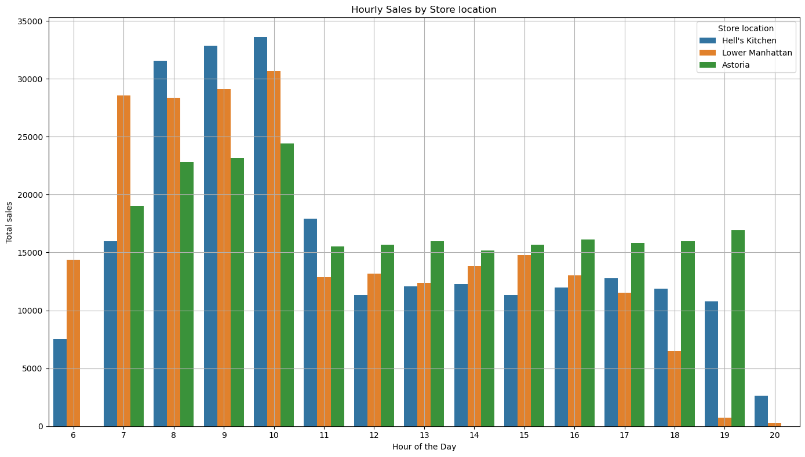
    


```python

```
